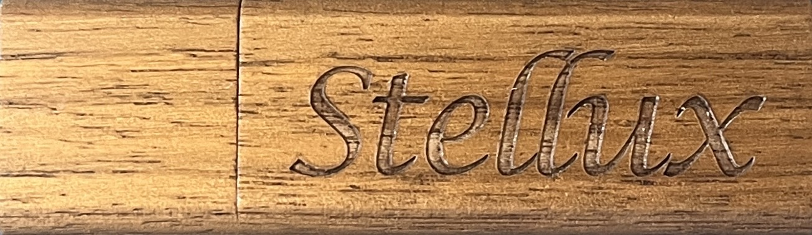
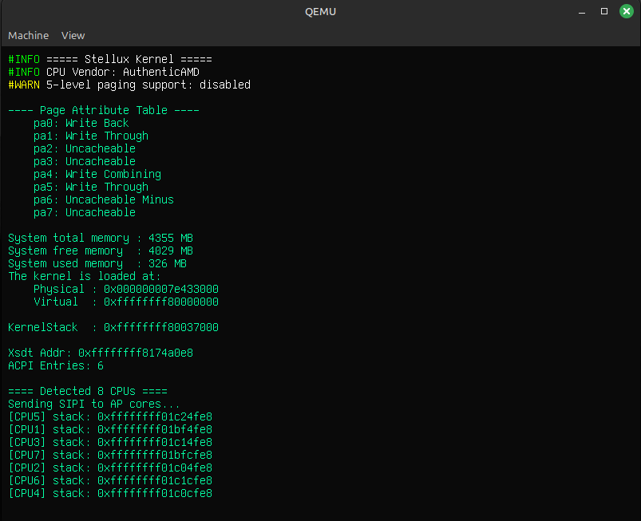
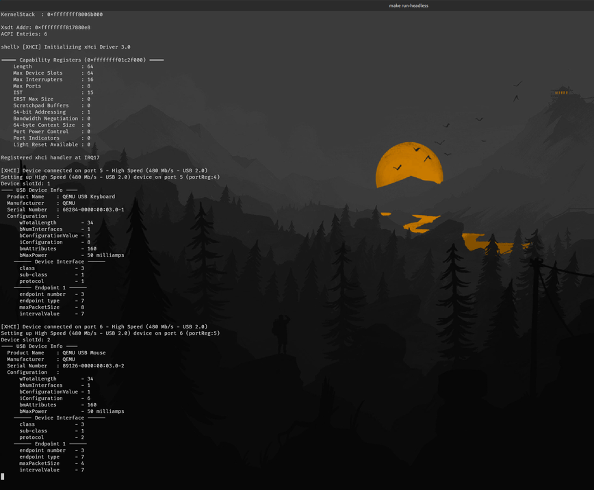

<div align="center">

  
  <h1>Stellux OS</h1>
  
  <p>
    StelluxOS is a personal operating system project inspired by Symbiote project's philosophy of providing runtime privilege
    level switching mechanism for userspace threads. The unique feature of StelluxOS is that within the authoritative OS-level
    privileged domain, threads can transition in and out of hardware privilege at a very low cost using light-weight primitives
    called <b>elevate</b> and <b>lower</b>. This use of dynamic privilege would allow deprivileging large parts of the kernel
    and allow threads within the "<i>blessed</i>" kernel address space to acquire privilege when needed, performing privileged operations,
    and dropping hardware privileges right after.
  </p>
  <p>
    The benefit of this design that we aim to explore is that, for example, if a driver or a filesystem component
    has a memory corruption bug and causes a stray write that would overwrite a bit in some page table entry, in a regular
    monolithic kernel this might not show any problematic symptoms until later down the line, however in Stellux, if an unprivileged
    driver makes such a stray write into a privileged region or data structure, it would cause a page fault with a nice backtrace
    showcasing what happened right there and then when it actually happened.
  </p>
  <p>
    Additionally, this design might bring a new persepctive on how privilege is viewed, used, and leveraged in userspace
    applications, potentially offering new design spaces that we are yet to explore. <b>It is important to note</b>, the goal
    of StelluxOS is <b>NOT</b> to replace an existing design or claim that this one is better, but rather explore a new point
    in the design space and potentially offer a new avenue for operating system research.
  </p>

  <!-- Badges -->
  <p>
    <a href="https://github.com/FlareCoding/StelluxOS/actions/workflows/ci.yml">
      
    </a>
    <a href="https://github.com/FlareCoding/StelluxOS/graphs/contributors">
      
    </a>
    <a href="">
      
    </a>
    <a href="https://github.com/FlareCoding/StelluxOS/network/members">
      
    </a>
    <a href="https://github.com/FlareCoding/StelluxOS/stargazers">
      
    </a>
    <a href="https://github.com/FlareCoding/StelluxOS/issues/">
      
    </a>
    <a href="https://github.com/FlareCoding/StelluxOS/blob/master/LICENSE">
      
    </a>
  </p>
   
  <h4>
    <a href="https://github.com/FlareCoding/StelluxOS/">View Demo</a>
    <span> · </span>
    <a href="https://github.com/FlareCoding/StelluxOS">Documentation</a>
    <span> · </span>
    <a href="https://github.com/FlareCoding/StelluxOS/issues/">Report Bug</a>
    <span> · </span>
    <a href="https://github.com/FlareCoding/StelluxOS/issues/">Request Feature</a>
  </h4>
</div>

<br />

<!-- Table of Contents -->
# :book: Table of Contents

- [About the Project](#star2-about-the-project)
  * [Screenshots](#camera-screenshots)
  * [Supported Architectures](#desktop_computer-supported-architectures)
  * [Features](#dart-features)
- [Getting Started](#gear-getting-started)
  * [Prerequisites](#bangbang-prerequisites)
  * [Building and Running](#hammer_and_wrench-building-and-running-the-project)
  * [Debugging](#wrench-debugging)
  * [Baremetal Debugging](#wrench-debugging)
- [Contributing](#wave-contributing)
- [License](#newspaper-license)
- [Acknowledgements](#gem-acknowledgements)

  

<!-- About the Project -->
## :star2: About the Project
StelluxOS is an operating system project inspired from my research with Tommy Unger and Jonathan Appavoo at Boston University.
The work that inspired it is Symbiote - a chronokernel approach to dissolving the barrier between userspace and kernelspace.
The motivation behind Symbiote was to provide an "elevation" mechanism for userspace threads to allow them to run at privileged
supervisor level. The benefit of this approach is that it combines debuggability and ease of development of userspace applications,
encourages the use of third-party libraries, while providing functionality and performance benefits of a kernel module.

The goal for Stellux operating system is to be developed stemming and being built on top of Symbiote's philosophy that threads can
make a runtime choice of elevating or lowering themselves, effectively transitioning in and out of hardware privilege. The benefit
of this design that we aim to explore is that, for example, if a driver or a filesystem component has a memory corruption bug and
causes a stray write that would overwrite a bit in some page table entry, in a regular monolithic kernel this might not show any
problematic symptoms until later down the line, however in Stellux, if an unprivileged driver makes such a stray write into a
privileged region or data structure, it would cause a page fault with a nice backtrace showcasing what happened right there and then
when it actually happened.

<!-- Screenshots -->
### :camera: Screenshots

<div align="center"> 
  
  <br/>
  
</div>

<!-- Features -->
### :dart: Features

- Userspace and syscall support
- Multithreading
- SMP multicore support
- Kernel and userspace thread management
- `elevate`/`lower` mechanisms for runtime privilege switching
- PCI device enumeration
- Optimized write-combining graphics buffer management
- HPET and time management support
- Stacktrace dump from the _interrupt_ context
- Kernel module subsystem allowing daemons and drivers to be spawned easily
- Xhci driver module for USB stack support
- Unit testing framework integrated with Github Actions CI pipeline
- VFS and RAM filesystem support
- GDB server stub for low-level kernel debugging, including breakpoint and memory
  inspection support on baremetal

<!-- Getting Started -->
## :gear: Getting Started

<!-- Prerequisites -->
### :bangbang: Prerequisites

Clone the repository
```bash
git clone https://github.com/FlareCoding/StelluxOS.git
```

Install dependencies
```bash
make install-dependencies
```

<!-- Building and Running the Project -->
### :hammer_and_wrench: Building and Running the Project

To build the __Stellux__ image, simply run
```bash
make image
```

Running in QEMU in a separate graphical window
```bash
make run
```

Running in QEMU headless in the current shell<br/>
*Note: use this if in _ssh_ session*
```bash
make run-headless
```

Running unit-tests
```bash
make execute-unit-tests
```

<!-- Debugging -->
### :wrench: Debugging

1) Run a headless QEMU session in the current shell
```bash
make run-debug-headless
```
*Note: This will hang until a GDB client connects to the stub*

2) In a separate shell connect to the GDB server
```bash
make connect-gdb
```
*Note: Type 'y' in the prompt and continue, the kernel will hit a breakpoint on kernel entry*

<!-- Baremetal Debugging -->
### :wrench: Baremetal Debugging

In my personal setup, I have installed a PCIe serial controller card which
Stellux looks for during PCI device enumeration. If you include `enable-gdb-stub`
in GRUB kernel command line args, and have a second machine watching the serial port,
you could run `make connect-gdb-serial` and be able to debug Stellux running on a baremetal
machine using GDB.

*Note: you might need to modify the `connect-gdb-serial` make target to specify your serial tty device you are using.*

<!-- Contributing -->
## :wave: Contributing

<a href="https://github.com/FlareCoding/StelluxOS/graphs/contributors">
  
</a>

Contributions are always welcome through pull requests.

<!-- License -->
## :newspaper: License

[](https://opensource.org/licenses/MIT)


<!-- Acknowledgments -->
## :gem: Acknowledgements

This work was supported by the
Red Hat Collaboratory at Boston University under the award “Symbiotes: A New Step in Linux’s Evolution”,
Red Hat Collaboratory Research Incubation Award Program (2024-01-RH12)

Additionally, special thanks to Dr. Tommy Unger for the Symbiote and kElevate work, Dr. Jonathan Appavoo for supporting
this project from inception, and all the support they brought to the table.
