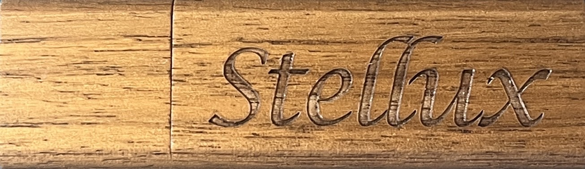
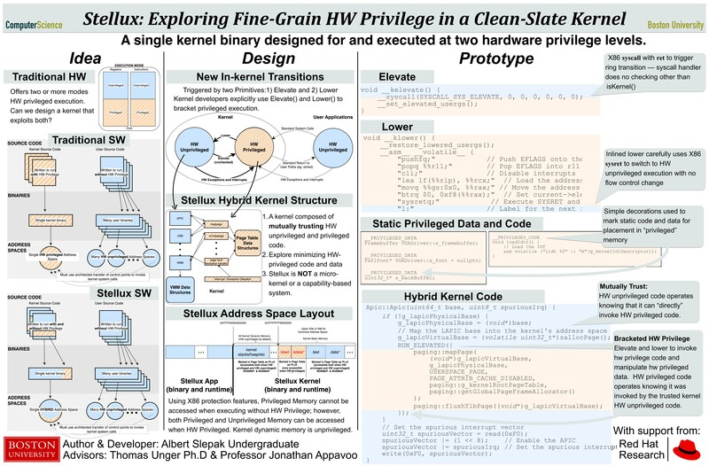
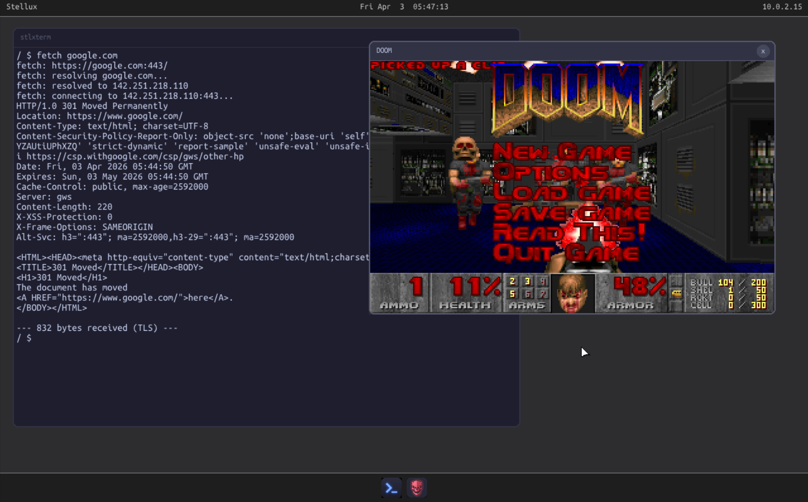
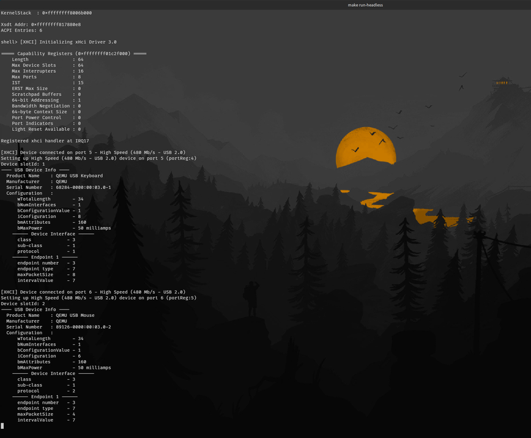

<div align="center">
  
  <h1>Stellux OS</h1>
  <p>
    A research operating system exploring runtime privilege transitions for kernel threads.
  </p>
  <p>
    <a href="https://github.com/FlareCoding/StelluxOS/actions/workflows/kernel-unit-tests.yml">
      
    </a>
    <a href="https://github.com/FlareCoding/StelluxOS/graphs/contributors">
      
    </a>
    <a href="https://github.com/FlareCoding/StelluxOS/stargazers">
      
    </a>
    <a href="https://github.com/FlareCoding/StelluxOS/blob/master/LICENSE">
      
    </a>
  </p>
</div>

## Overview

<p>
StelluxOS is a personal operating system project inspired by <a href="https://github.com/Symbi-OS/">Symbiote</a> project's philosophy of providing runtime privilege
level switching mechanism for userspace threads. The unique feature of StelluxOS is that within the authoritative OS-level
privileged domain, threads can transition in and out of hardware privilege at a very low cost using lightweight primitives
called <b>elevate</b> and <b>lower</b>. This use of dynamic privilege would allow deprivileging large parts of the kernel
and allow threads within the "<i>blessed</i>" kernel address space to acquire privilege when needed, performing privileged operations,
and dropping hardware privileges right after.
</p>
<p>
The benefit of this design that we aim to explore is that, for example, if a driver or a filesystem component
has a memory corruption bug and causes a stray write that would overwrite a bit in some page table entry, in a regular
monolithic kernel this might not show any problematic symptoms until later down the line, however in Stellux, if an unprivileged
driver makes such a stray write into a privileged region or data structure, it would cause a page fault with a nice backtrace
showcasing what happened right there and then when it actually happened.
</p>
<p>
Additionally, this design might bring a new perspective on how privilege is viewed, used, and leveraged in userspace
applications, potentially offering new design spaces that we are yet to explore. <b>It is important to note</b>, the goal
of StelluxOS is <b>NOT</b> to replace an existing design or claim that this one is better, but rather explore a new point
in the design space and potentially offer a new avenue for operating system research.
</p>

### Research Basis

The design and motivation behind StelluxOS are described in my SOSP 2024 poster:

<div align="center">
  <a href="specs/stellux.pdf">
    
  </a>
</div>

## Screenshots

<div align="center">
  
  <br/>
  
</div>

## Supported Platforms

| Architecture | Platform | Status | Hardware Tested |
|---|---|---|---|
| x86_64 | Generic UEFI | Fully supported | Yes (RTL8168 NIC, PCIe serial, xHCI USB) |
| AArch64 | QEMU virt | Fully supported | QEMU |
| AArch64 | Raspberry Pi 4 (BCM2711) | Supported | Yes |

The kernel boots via the [Limine](https://github.com/limine-bootloader/limine)
UEFI boot protocol on all platforms. The RPi4 target uses UEFI firmware from
the [pftf/RPi4](https://github.com/pftf/RPi4) project.

## Getting Started

### Prerequisites

Debian/Ubuntu is the primary development environment. The kernel is built with
Clang/LLD; userland applications link against a statically-built musl libc.

Clone the repository and run the one-time setup:

```
git clone https://github.com/FlareCoding/StelluxOS.git
cd StelluxOS
make deps
make limine
make musl
```

`make deps` installs system packages (clang, lld, llvm, qemu, ovmf, mtools,
etc.). `make limine` downloads the Limine bootloader binaries. `make musl`
builds musl 1.2.5 for both x86_64 and aarch64.

Run `make toolchain-check` to verify everything is in place.

For RPi4 support, also run:

```
make rpi4-firmware
```

### Building

All build and run targets require an `ARCH` parameter (`x86_64` or `aarch64`).

```
make image ARCH=x86_64          # Build kernel + userland + disk image
make image ARCH=aarch64         # Same for AArch64
```

Shortcut targets that do not require `ARCH`:

```
make image-x86_64
make image-aarch64
```

### Running in QEMU

```
make run ARCH=x86_64             # QEMU with graphical window
make run-headless ARCH=x86_64    # Headless (serial on stdio, useful over SSH)
```

### Running Unit Tests

```
make test ARCH=x86_64
make test ARCH=aarch64
```

### Debugging with GDB

In one terminal, start QEMU with the GDB stub:

```
make run-qemu-x86_64-debug-headless
```

In another terminal, connect GDB:

```
make connect-gdb-x86_64
```

The same pattern applies for AArch64 (`run-qemu-aarch64-debug-headless`,
`connect-gdb-aarch64`). On AArch64, the Makefile uses `gdb-multiarch`.

### Baremetal Debugging

StelluxOS includes a GDB server stub that can operate over a PCIe serial
controller on real hardware. Add `enable-gdb-stub` to the GRUB/Limine kernel
command line arguments, then connect from a second machine watching the serial
port. You may need to adjust the serial TTY device in the connect target.

### USB Boot

```
make usb ARCH=x86_64
```

This builds the image and prints instructions for writing it to a USB drive
with `dd`.

### Build Options

| Option | Description |
|---|---|
| `V=1` | Verbose output (show compiler commands) |
| `RELEASE=1` | Release build (O2 optimization) |
| `DEBUG=1` | Debug build (default) |

## Reference Specifications

The `specs/` directory contains reference documents used during development:

- [specs/stellux.pdf](specs/stellux.pdf) -- Stellux project poster
- [specs/64-ia-32-architectures-software-developer-vol-3a-part-1-manual.pdf](specs/64-ia-32-architectures-software-developer-vol-3a-part-1-manual.pdf) -- Intel SDM Vol. 3A
- [specs/extensible-host-controler-interface-usb-xhci.pdf](specs/extensible-host-controler-interface-usb-xhci.pdf) -- xHCI specification
- [specs/USB 3.2 Revision 1.1.pdf](specs/USB%203.2%20Revision%201.1.pdf) -- USB 3.2 specification

## Contributing

Contributions are welcome through pull requests.

<a href="https://github.com/FlareCoding/StelluxOS/graphs/contributors">
  
</a>

## License

[MIT](https://opensource.org/licenses/MIT)

## Acknowledgements

This work was supported by the Red Hat Collaboratory at Boston University under
the award "Symbiotes: A New Step in Linux's Evolution", Red Hat Collaboratory
Research Incubation Award Program (2024-01-RH12).

Special thanks to Dr. Tommy Unger for the Symbiote and kElevate work, and
Dr. Jonathan Appavoo for supporting this project from inception.
